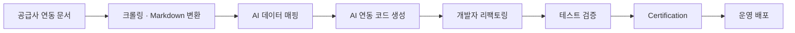

## 배경

- **직계약**은 호텔과 직접 계약해 재고·요금을 받아오는 방식으로, 중간 공급사를 거치는 것보다 마진과 가격 통제권이 크다. 직계약 숙소를 늘리려면 호텔이 이미 쓰고 있는 CMS(Channel Management System)와의 연동이 필수인데, 공급사마다 스펙 문서·인증 절차가 달라 **연동 1건에 최소 2개월**이 걸렸고 그 대부분이 스펙 분석·매핑·보일러플레이트 작성이었음
- 신규 글로벌 CMS인 DerbySoft 연동을 진행하면서, "이번 한 건"이 아니라 **연동 방법론 자체를 자동화**하는 것을 목표로 설정 (에픽 리드)

## 주요 작업

- 공급사 연동 문서를 크롤링해 Markdown 스펙으로 변환하고, 이를 기반으로 도메인 모델 매핑과 연동 코드 초안을 생성하는 **Claude Code Skill 제작**
- 생성된 코드를 개발자가 리팩토링하고 테스트·Certification으로 검증하는 단계까지 하나의 파이프라인으로 묶어, 사람이 어디에 붙는지를 명확히 구분
- 스펙 해석이 갈리는 지점들을 정리해 **벤더와 영문으로 직접 협의**, VCC(가상카드) 결제 정보 전송 구현
- 파트너/매니저 어드민에 공급사 매핑·CMS 코드 관리 기능 추가 (React)
- 표준화된 연동 문서 저장소 신설 — CMS/PMS/OTA **연동 문서 270여 개**를 Markdown으로 축적해 후속 공급사에 재사용

## 성과

- 사람이 하던 스펙 분석·매핑·보일러플레이트 작성을 AI로 대체해, **최소 2개월이던 연동 개발을 2주에 완료** (분기 팀 회고에 리드타임 단축 사례로 기록)
- 2월 검토 시작 → 4월 Certification 통과 → 5월 운영 배포로 완주. 남은 기간은 벤더 인증 절차와 응답 대기여서, **개발이 더 이상 리드타임의 병목이 아닌 상태**로 전환
- 1회성 연동 개발이 아닌 **재사용 가능한 연동 자동화 방법론**을 팀 자산으로 정착시킴
