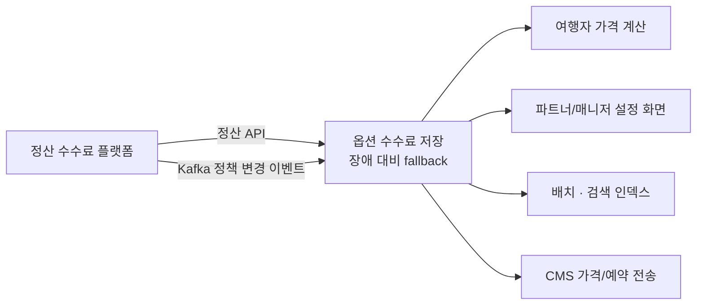

## 배경

- 기존 숙박 수수료는 파트너(숙소)당 단일 요율만 지원해, 상품별 차등 요율·프로모션별 정산 정책을 적용할 수 없었고 정산 오류 문의의 원인이 됨
- 전사 정산 수수료 플랫폼이 구축되면서, 숙박 도메인의 가격·정산 로직 전체를 **옵션(상품) 레벨 수수료 체계**로 전환하는 과제를 담당

## 주요 작업

- 정산 플랫폼 API 연동 및 장애 대비 설계 — 플랫폼 장애 시 저장된 옵션 수수료로 동작하는 **fallback + 알람** 구조
- 수수료 정책 변경을 Kafka 이벤트로 실시간 동기화 (정산팀과 이벤트 스키마 협의), 동기화 배치 별도 구성
- 가격이 계산되는 모든 지점 수정: 여행자(숙소 상세·주문서·결제 전 가격 검증), 파트너(리스팅·객실/옵션 생성·복사·캘린더), 매니저(숙소 복제·정산 설정), 배치(초기 데이터 세팅·검색 인덱스), CMS(가격 동기화·예약 전송)
- 파트너/매니저 어드민 화면의 수수료 설정 UI 변경 (React)
- 11단계 배포 체크리스트 수립 후 단계별 배포, QA에서 나온 가격 오노출 버그 9건 전량 수습

## 성과

- 4개 서비스(백엔드 2, 프론트 2)를 관통하는 가격 체계 전환을 **서비스 중단 없이 운영 전환 완료**
- 숙소/옵션별 차등 수수료를 즉시 적용할 수 있게 되어 영업·정산 유연성 확보
- 모든 가격 조회 결과에 수수료 정책 ID를 포함시켜 **정산 검증·오류 추적이 가능한 구조**로 개선
