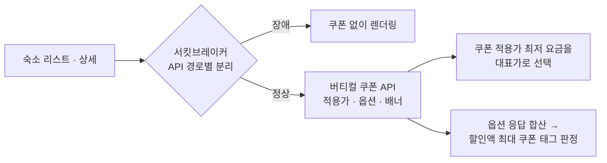

## 배경

- 전사 혜택 플랫폼에 **주문 쿠폰**(주문 총액 기준으로 1장 더 적용되는 쿠폰)이 신설됐지만, 숙소 리스트·상세는 상품 쿠폰만 계산하는 전용 로직을 쓰고 있어 **주문 쿠폰이 빠진 가격이 노출**되고 있었음
- 실제 결제가보다 비싼 값이 걸려 있는 셈이라, 가격 비교가 직접 일어나는 지면에서 불리한 상태였음

## 주요 작업

- 숙소 전용 쿠폰 계산 로직을 **버티컬 쿠폰 API로 교체**해, 상품 쿠폰과 주문 쿠폰이 모두 반영된 가격을 받도록 재구성
- **최저가 선택 기준 자체를 변경** — 노출할 요금을 정가가 아니라 **쿠폰 적용가가 가장 낮은 요금**으로 고르도록 전환
- **쿠폰 태그 판정 로직 설계** — 쿠폰 플랫폼이 태그 문구를 내려주지 않아, 할인액이 가장 큰 쿠폰을 직접 고르고 문구까지 판정하는 규칙을 만듦
- 세일페스타처럼 **기간이 정해진 쿠폰이 상시 최저가를 오염시키지 않도록** 기간 필터 추가
- **장애 대응** — 리스트 1회 조회가 쿠폰 API를 2번 부르고 각각 3회 재시도하던 구조여서, 쿠폰이 느려지면 부하가 스스로 커졌음. 중복 호출과 재시도를 걷어내고 서킷브레이커를 4개로 분리해 **1시간 내 핫픽스**, 원인·조치를 전사 공유
- 프로모션 기간 중 검색 엔진 CPU 급증 이슈 등 연관 장애 분석·대응

## 성과

- 숙소 리스트·상세에 **상품 쿠폰과 주문 쿠폰이 모두 반영된 실결제가**가 노출되도록 전환 — 유럽 호텔 타임세일 등 실제 프로모션에서 활용
- 쿠폰 플랫폼 장애가 숙박 서비스 전체로 전파되지 않는 **격리 구조** 확보 — 동일 유형 장애 재발 없음
- 연동 이후 타 팀의 쿠폰 적용가 API 문의 창구 역할 수행 (도메인 전문가)
