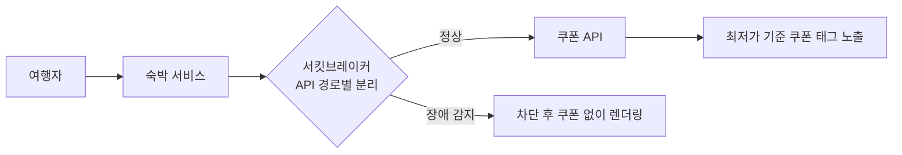

## 배경

- 기존 숙소 도메인은 **쿠폰을 1개만 적용할 수 있는 구조**여서, 혜택 플랫폼에 주문 쿠폰이 신설돼도 상품 쿠폰과 함께 쓸 수 없어 프로모션 설계의 폭이 제한되고 타 버티컬 대비 혜택 소구가 약했음
- 연동 직후 쿠폰 API 장애가 서비스 화면 전체에 전파되는 사고가 발생해, 장애 격리 구조 개선까지 함께 수행

## 주요 작업

- 주문 쿠폰 플랫폼과 통합숙소 연동 — 추가 옵션 가격까지 반영된 **최종 결제가에 쿠폰이 올바른 순서로 적용**되도록 가격 파이프라인 재정비
- 숙소 검색·상세·주문서 등 할인 금액이 노출되는 모든 지면에서 일관된 경험이 되도록 최저가 기준 쿠폰 태그 노출 개발
- **장애 대응**: 쿠폰 API 타임아웃으로 숙소 화면이 렌더링되지 않는 장애 발생 → 원인 분석 후 **재시도 로직 제거 + API 경로별 서킷브레이커 분리** 적용, 원인·조치를 전사 공유
- 프로모션 기간 중 검색 엔진 CPU 급증 이슈 등 연관 장애 분석·대응

## 성과

- 숙소에서 **상품 쿠폰 + 주문 쿠폰 중복 적용**이 가능해져 프로모션 조합이 다양해지고 고객 체감 할인 폭 확대 — 유럽 호텔 타임세일 등 실제 프로모션에서 활용
- 쿠폰 플랫폼 장애가 숙박 서비스 전체로 전파되지 않는 **격리 구조** 확보 — 동일 유형 장애 재발 없음
- 연동 이후 타 팀의 쿠폰 적용가 API 문의 창구 역할 수행 (도메인 전문가)
