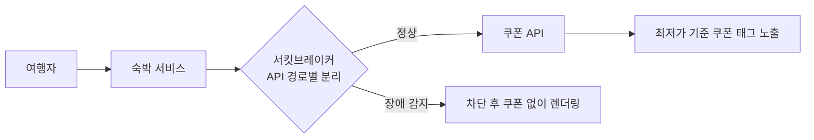

## 배경

- 전사 혜택 플랫폼(주문 쿠폰)이 도입되면서 숙박 도메인의 가격·쿠폰 로직을 새 플랫폼 규격에 맞게 연동해야 했음 (이전에 통합숙소 중복 쿠폰 연동도 담당)
- 연동 직후 쿠폰 API 장애가 서비스 화면 전체에 전파되는 사고가 발생해, 장애 격리 구조 개선까지 함께 수행

## 주요 작업

- 주문 쿠폰 연동 — 추가 옵션 가격 적용 후 쿠폰이 적용되도록 계산 순서 보정, 숙소 검색 결과에 최저가 기준 쿠폰 태그 노출
- **장애 대응**: 쿠폰 API 타임아웃으로 숙소 화면이 렌더링되지 않는 장애 발생 → 원인 분석 후 **재시도 로직 제거 + API 경로별 서킷브레이커 분리** 적용, 원인·조치를 전사 공유
- 프로모션 기간 중 검색 엔진 CPU 급증 이슈 등 연관 장애 분석·대응
- 연동 이후 타 팀의 쿠폰 적용가 API 문의 창구 역할 수행 (도메인 전문가)

## 성과

- 쿠폰 플랫폼 장애가 숙박 서비스 전체로 전파되지 않는 **격리 구조** 확보 — 동일 유형 장애 재발 없음
- 숙박 도메인의 쿠폰 노출·적용 로직이 전사 표준 플랫폼 위에서 동작하도록 전환 완료
