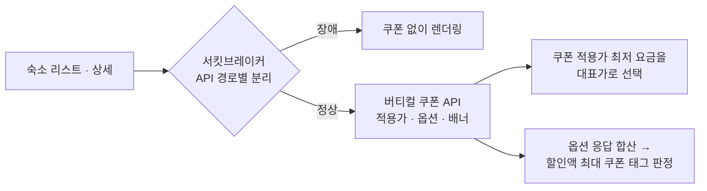

## 배경

- 전사 혜택 플랫폼에 **주문 쿠폰**(주문 총액 기준으로 1장 더 적용되는 쿠폰)이 신설됐지만, 숙소 리스트·상세는 상품 쿠폰만 계산하는 전용 로직을 쓰고 있어 **주문 쿠폰이 빠진 가격이 노출**되고 있었음
- 실제 결제가보다 비싼 값이 걸려 있는 셈이라, 가격 비교가 직접 일어나는 지면에서 불리한 상태였음
- 연동 직후 쿠폰 API 장애가 숙소 화면 전체에 전파되는 사고가 발생해, 장애 격리 구조 개선까지 함께 수행

## 주요 작업

- 숙소 전용 쿠폰 계산 로직을 **버티컬 쿠폰 API로 교체** — 리스트 대표가, 옵션·요금제 단위, 배너 세 가지를 용도별로 나눠 호출하고 상품·주문 쿠폰이 모두 반영된 가격을 받도록 재구성
- **최저가 선택 기준 자체를 변경** — 노출할 요금을 고를 때 정가가 아니라 **쿠폰 적용가가 가장 낮은 요금**을 대표가로 선택하도록 전환. 쿠폰 적용가가 없으면 기존 가격으로 폴백
- **쿠폰 태그 판정 로직 설계** — 별도 태그 API 없이 옵션 API 응답 전체를 합산해 할인액이 가장 큰 쿠폰을 고르고, 상품 쿠폰 1개 + 주문 쿠폰 1개까지 노출. 쿠폰 플랫폼이 태그 문구를 내려주지 않아 **템플릿명 prefix 기준으로 문구를 결정**(항공 예약자 전용 · 기간 한정 · 선착순 · 추가할인)
- **세일페스타 쿠폰 기간 필터** — 행사 기간이 아닐 때 세일페스타 쿠폰이 가격 계산에 섞여 상시 최저가를 오염시키지 않도록 리스트·옵션·단건 조회에서 제외
- **장애 대응** — 쿠폰 API 타임아웃으로 숙소 화면이 렌더링되지 않는 장애 발생 → 원인 분석 후 **재시도 로직 제거 + API 경로별 서킷브레이커 분리** 적용, 원인·조치를 전사 공유
- 프로모션 기간 중 검색 엔진 CPU 급증 이슈 등 연관 장애 분석·대응

## 성과

- 숙소 리스트·상세에 **상품 쿠폰과 주문 쿠폰이 모두 반영된 실결제가**가 노출되도록 전환 — 유럽 호텔 타임세일 등 실제 프로모션에서 활용
- 쿠폰 플랫폼 장애가 숙박 서비스 전체로 전파되지 않는 **격리 구조** 확보 — 동일 유형 장애 재발 없음
- 연동 이후 타 팀의 쿠폰 적용가 API 문의 창구 역할 수행 (도메인 전문가)
