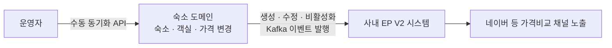

## 배경

- 가격비교 채널(네이버 EP)은 숙박의 주요 유입 경로인데, 기존 전송이 "버티컬 DB → Airflow 수집/변환 → 전송" 배치 구조라 **데이터 반영 지연과 유지보수 비용**이 커지고 있었음
- 전사적으로 "버티컬별 Kafka 발행 → EP 시스템 수신/전송" 이벤트 기반 구조로의 전환(EP V2)이 추진되며 숙소 도메인 연동을 담당

## 주요 작업

- 숙소 도메인에서 **EP 대상 데이터와 변경 트리거 정의** — 숙소/객실/가격 등 주요 변경 시점 식별
- 생성·수정·비활성화 **변경 유형별로 일관된 Kafka 메시지**를 EP 스키마에 맞춰 발행하도록 설계·구현
- EP 팀과 **메시지 계약·전송 시점·누락/중복 리스크를 사전 조율**해 연동 안정성 확보
- 운영자가 즉시 반영할 수 있는 수동 동기화 API, 피드 필터 조건 정비(B2B 숙소 제외 등) 병행

## 성과

- 배치 의존을 줄여 **상품 정보의 채널 반영 지연 개선**, 전사 이벤트 기반 표준 전환에 숙소 도메인이 조기 안착
- 국내·해외 **숙박 상품 10만여 건**이 신규 피드 시스템 위에서 안정적으로 발행
- 이후 다른 도메인·채널 확장 시 재사용 가능한 이벤트 연동 패턴 확립
