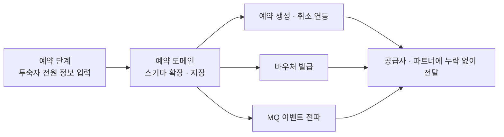

## 배경

- 해외 숙소 예약이 **예약자 1명 정보만 수집**하는 구조라, 투숙자 전원 정보가 필요한 숙소에서는 예약 후 고객에게 추가 연락이 발생 — 고객 경험 악화와 예약 실패 리스크로 이어지고 있었음

## 주요 작업

- 예약 단계에서 **투숙자 전원 정보를 수집·저장**할 수 있도록 스키마 설계·확장
- 예약 생성·취소 연동, 바우처 발급, MQ 이벤트 흐름까지 투숙자 정보가 **누락 없이 전달되도록 E2E로 확장**

## 성과

- 고객이 **추가 요청 없이 한 번에 예약을 완료**할 수 있는 구조로 개선
- 운영팀의 사후 커뮤니케이션이 줄어 **예약 성공률과 운영 효율이 함께 개선**
