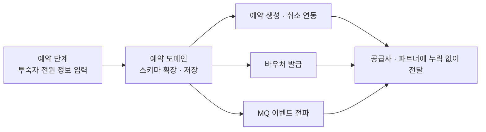

## 배경

- 해외 직계약 숙소는 랜드사를 거쳐 예약이 이뤄지는데, 최종 확정에 필요한 **투숙객 전원 정보를 예약이 끝난 뒤에 파트너가 고객에게 따로 요청**하는 구조였음
- 이 대기 구간이 **해외 직계약에서 예약 취소가 가장 많이 발생하는 지점**으로, 확정률 저조 이슈의 직접 원인으로 지목돼 있었음
- 2024년 중반부터 기획만 올라와 있던 과제를 입사 직후 맡아 2025년 1분기에 배포

## 주요 작업

- 주문서에서 **조회한 인원 수만큼 입력 칸을 펼쳐** 투숙자 전원의 정보를 수집하도록 구현 — 대표 여행자로 지정된 1명만 연락처를 추가로 받음

- 해외 스테이넷 숙소와 OTA 연동사 상품까지 적용 범위를 맞추고, 예약 생성·확정·취소·바우처·MQ 이벤트까지 정보가 **누락 없이 전달되도록 E2E 확장**
- **기존 예약 건 하위 호환** — 예약 상세의 체크인 고객 정보 구조가 바뀌는 변경이라, 신규 필드가 없는 기존 예약은 종전 방식으로 동작하도록 방어
- 배포 순서가 어긋나면 바우처에서 투숙자 정보가 빠지는 구조여서, **단계를 쪼개고 각 단계마다 예약·취소를 실검증**하며 배포

## 성과

- 확정에 필요한 정보를 **예약 시점에 전부 확보**하는 구조로 전환해, 해외 직계약 취소의 최대 원인이던 "예약 후 정보 수집 대기" 구간을 제거
- 고객은 추가 연락 없이 한 번에 예약을 마치고, 파트너·매니저는 예약 상세에서 투숙자 전원 정보를 바로 확인
- 운영 중인 예약 흐름을 바꾸는 변경을 **기존 예약 건 영향 없이 무중단으로 완료**
