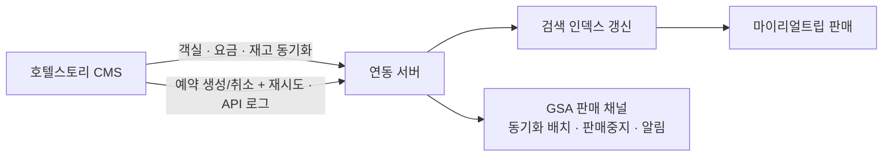

## 배경

- 국내 중소형 숙소(펜션·풀빌라 등)를 직계약으로 확보하려면, 해당 시장 점유율이 높은 CMS인 호텔스토리와의 연동이 필요했음
- 연동 전에는 직계약 숙소의 가격·재고·예약과 숙소 메타 정보를 **운영자가 수기로 관리**하던 상황 — 신규 공급사 연동을 처음부터 끝까지 담당한 첫 프로젝트

## 주요 작업

- 연동 스펙 검토 후 프로젝트 세팅, 개발/테스트/운영 환경 구성 (EKS 리소스·DB·API Gateway 라우팅 요청 포함)
- 객실·상품·블록/요금 조회 API, 가격/재고 동기화(검색 인덱스 갱신 포함), 예약 생성·취소 연동 개발
- 예약 실패에 대비한 **재시도 로직**과 연동 추적을 위한 **API 로그 프로세스** 구축
- GSA(총판) 판매 채널 구축 — 동기화 배치, 판매 중지 자동 처리, 상태 변경 알림 배치, 이미지 관리
- 일일 배치로 숙소 메타 정보(숙소/객실/옵션/취소정책)가 자동 등록되도록 구성
- 연동 숙소의 파트너 페이지 수정 제한 등 어드민 정책 처리, 매니저/파트너 화면 수정 (React)
- 이후 사이트커넥트(SiteConnect) 예약·취소 연동(요청 암호화, 재시도, 추가 옵션 예약)으로 동일 패턴 확장 — 동남아 직계약 숙소의 **예약 확정율을 47% → 74% 수준으로 끌어올리는 것을 목표**로 진행

## 성과

- 신규 CMS 연동을 약 2개월 만에 운영 배포(Last-CR)하고, 운영 개입 없이 정보·예약이 처리되는 판매 채널 확보 — **연동 숙소 150여 개·자동 확보 상품 200여 개** 규모로 성장
- 국내외 CMS 채널이 5종 이상으로 확장되며 **월 수천 건 규모의 예약이 사람 개입 없이 처리**되는 기반이 됨
- 운영 중 발생한 요금 전송·타입 불일치 이슈를 스펙 문서화로 벤더와 협의해 해결 — 이 경험이 이후 **CMS 연동 자동화 파이프라인 설계의 토대**가 됨
