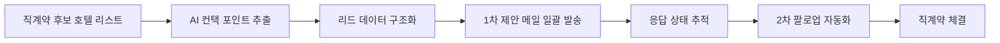

## 배경

- CMS 연동 자동화로 기술적 연동 속도는 빨라졌지만, 그 앞단인 **"어느 호텔과 계약할지 찾고 컨택하는" 영업 프로세스가 수작업**이라 직계약 확대의 새로운 병목이 됨
- 사업부 요구를 개발로 풀어내는 에픽을 리드하며, 리드 발굴 → 1차 컨택 → 후속 컨택 흐름을 자동화

## 주요 작업

- 직계약 후보 호텔 리스트에서 **컨택 포인트를 AI로 일괄 추출**하는 파이프라인 구축 — 실제 확인된 주소와 이름 기반 추측 주소를 **"확인됨 / 예측"으로 구분**해 잘못된 주소로 발송되는 것을 막고, 수동 확인 결과를 프롬프트에 반영하며 정확도를 반복 개선
- 비개발 직군도 쓸 수 있도록 **엑셀 스크립트와 Claude Code 플러그인 두 가지 형태로 제공**
- 구글시트 기반 **1차 제안 메일 일괄 전송** 기능 개발 — 발송 대상 필터, 담당자 CC, 반송 대응 등 사업부 피드백을 받아가며 보완
- 발송 이력·응답 상태를 추적할 수 있도록 데이터를 구조화하고, 2차 팔로업 자동화까지 설계

## 성과

- 사업부 실측 기준 **282곳 발송이 수작업 4.7시간 → 10분**으로 단축 — 건당 컨택 탐색 1분 + 단체 발송 5분이던 구조를 제거. 키맨 연결률은 11%로 수작업과 동일해, **적중률은 유지한 채 처리량만 끌어올린 구조**
- AI 추출로 컨택 포인트 후보 약 7,000건에서 **실제 키맨(계약 담당자) 컨택 약 1,000건**을 발굴
- 푸꾸옥 테스트를 시작으로 상하이·중국 도시들, 미주/유럽팀, APAC팀까지 **여러 지역 팀이 직접 요청하는 표준 프로세스로 확산** — 사업부는 회신 대응과 계약 협상에만 집중
- 직계약 확대의 병목을 기술 연동(공급)에서 영업(수요)까지 **엔드투엔드로 해소**
