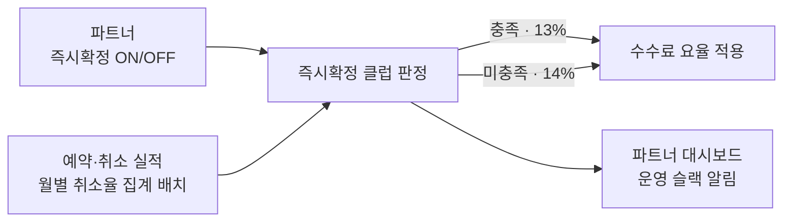

## 배경

- 한인민박은 직접 계약해 판매하는 숙소 카테고리(연 거래액 약 410억)로, 수수료율 10%가 경쟁사(약 13%)보다 낮아 수익성이 구조적으로 눌려 있었음
- 단순 인상은 파트너 이탈로 직결되므로, 기본 14%로 올리되 **즉시확정**(여행자가 예약하면 파트너 승인 없이 바로 확정되는 방식) 전환과 **낮은 귀책 취소율**을 충족한 숙소에 13%를 적용하는 **즉시확정 클럽**으로 설계 — 거래액의 67%가 즉시확정 미도입이었기에, 요율 인상과 예약 전환율 개선을 동시에 노린 구조
- 약관 통지 30일 규정으로 7/1 공지·8/1 발효 일정이 고정돼, **7월 안에 판정·집행 시스템이 완성되지 않으면 정책 자체가 발효 불가**한 조건 — 에픽을 맡아 백엔드 전량을 개발하고 프론트엔드·사업실과 일정을 조율

## 1단계 — 요율 개편과 클럽 판정

- **클럽 판정 엔진** — 숙소별 귀책 취소율(직전 3개월 결제분)을 월 단위로 집계하는 배치와 판정 로직 개발. 취소가 뒤늦게 발생하는 특성을 반영해 매월 직전 3개월을 재집계하는 구조로 설계하고, 서빙 API·배치·알림이 동일한 판정식을 공유하도록 단일 진입점으로 통합

- **직접 세운 초기 설계를 착수 후 폐기** — 처음에는 "취소율 판정에 필요한 결제일 축이 서비스 DB에 없다"고 판단해 DW(BigQuery)에서 계산한 뒤 야간 동기화하는 구조로 설계했음. 구현 전 검증에서 그 전제가 틀렸다는 것을 확인하고(서비스 DB만으로 집계 취소율이 소수점 4자리까지 일치) **BigQuery 연동을 통째로 걷어냄** — 외부 의존·동기화 지연·정합성 리스크가 함께 사라졌고, 배치 성능도 문제없음을 사전 실측으로 확인
- **파트너 셀프 즉시확정 전환** — 기존에는 파트너가 요청하면 운영자가 대신 변경해주던 설정을 파트너가 직접 토글하도록 개방
- **같은 숙소 내 방↔방 재고 연동** — 한 공간을 독채·도미토리로 중복 판매할 때 한쪽이 팔리면 다른 쪽을 자동 차단. 재계산을 예약 트랜잭션 커밋 이후 분산락 안에서 수행하도록 분리해, 차단 로직의 실패가 예약 자체를 롤백시키는 문제를 방지
- 확정방식 변경·신규 숙소 면책 종료·월간 클럽 선정 명단을 **슬랙으로 자동 통지**해, 사업 담당자가 요율 변동 근거를 개발자 조회 없이 확인
- 작업 중 발견한 **옵션 복제 API의 인가 누락**(다른 파트너의 옵션을 복제할 수 있던 문제) 수정

## 2단계 — 파트너 운영 도구 개선

요율을 올린 만큼 파트너가 체감할 개선이 필요해, 곧바로 예약·요금 관리 화면 개편으로 이어감.

- **예약 캘린더 월간뷰 재구성** — 장기·단기 예약이 섞인 도미토리에서도 예약이 겹치지 않게 배치. 방 35개·3개월 예약 827건 숙소에서 표시·전환·스크롤이 멈추지 않는 것까지 실운영으로 검증

- **요금·재고 캘린더를 1뎁스로 전환**하고 기간·요일 단위 일괄 수정을 도입. 날짜별 가격을 그 달의 분포 기준으로 색 구분해 비싼 날·싼 날이 한눈에 보이도록

- **객실 자동 열기** — 설정한 기간까지 요금·재고를 자동 생성하되 파트너가 직접 입력해 둔 날짜는 덮어쓰지 않도록 처리. 여러 객실이 공유하는 옵션이 일부만 생성되던 버그도 함께 수정

## 성과

- 기한 내 완료로 정책이 예정대로 발효되어, **거래액 가중 평균 수수료율 10.08% → 13.64%(+3.56%p)** — 정책이 목표한 가중 부담(13.7~13.9%)에 근접 착지 *(발효 2주 시점 기준)*
- 같은 기간(1~15일) 비교로 **거래액 +14.3%, 주문 +11.3%**, 거래가 발생한 숙소 수는 503 → 499로 유지 — **요율을 10%에서 14%로 올리고도 실질 이탈 없이 거래량이 유지·증가**. 수수료 수익은 2.27억 → 3.52억(+55%)
- 클럽 적용 숙소는 전체의 6.5%(161곳)이지만 **13% 우대 요율이 적용된 거래액은 35%** — 할인 혜택이 실제 거래를 일으키는 파트너에게 집중돼, 요율 인하가 거래 방어로 이어지는 구조 확인
- 2단계 배포 후 사업부가 파리·런던 현지 파트너를 방문해 받은 반응 — *"그간 했던 개편 중 최고였습니다. 가격 조정하는 것이 너무 편해졌어요"*, *"마리트는 확실히 투자를 하는구나, **수수료 올리는 만큼 투자하기로 작정했구나** 싶었어요"*. **요율 인상과 도구 개선을 함께 간 의도가 파트너에게 그대로 읽힘**
- 103개 파일·5,800여 줄 추가를 단일 배포로 반영하고, 배포 후 2주간 **신규 코드 관련 프로덕션 장애 0건**으로 안정 운영
