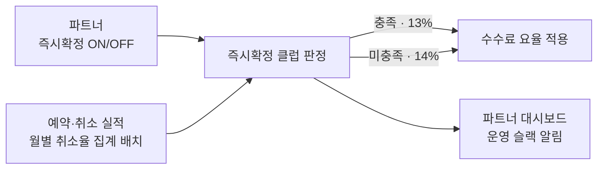

## 배경

- 한인민박은 직접 계약해 판매하는 숙소 카테고리(연 거래액 약 410억)로, 수수료율 10%가 경쟁사(약 13%)보다 낮아 수익성이 구조적으로 눌려 있었음
- 단순 인상은 파트너 이탈로 직결되므로, 기본 14%로 올리되 **즉시확정**(여행자가 예약하면 파트너 승인 없이 바로 확정되는 방식) 전환과 **낮은 귀책 취소율**을 충족한 숙소에 13%를 적용하는 **즉시확정 클럽**으로 설계 — 거래액의 67%가 즉시확정 미도입이었기에, 요율 인상과 예약 전환율 개선을 동시에 노린 구조
- 발효일(8/1)이 약관 통지 30일 규정으로 고정돼 있어, **7월 내 판정·집행 시스템 완성이 정책 발효의 전제 조건**이었음

## 주요 작업

- **클럽 판정 엔진** — 숙소별 귀책 취소율(직전 3개월 결제분)을 월 단위로 집계하는 배치와 판정 로직 개발. 취소가 뒤늦게 발생하는 특성을 반영해 매월 직전 3개월을 재집계하는 구조로 설계하고, 서빙 API·배치·알림이 동일한 판정식을 공유하도록 단일 진입점으로 통합
- **집계 위치를 데이터 웨어하우스에서 서비스 DB로 전환** — 초기 설계는 DW(BigQuery)에서 계산해 야간 동기화하는 방식이었으나, 검증 과정에서 서비스 DB만으로 동일한 값을 산출할 수 있음을 확인(집계 취소율이 소수점 4자리까지 일치). 외부 의존과 동기화 지연을 제거
- **파트너 셀프 즉시확정 전환** — 기존에는 파트너가 요청하면 운영자가 대신 변경해주던 설정을 파트너가 직접 토글하도록 개방. 운영자 화면과 같은 데이터를 공유해 양방향 실시간 반영
- **같은 숙소 내 방↔방 재고 연동** — 한 공간을 독채·도미토리로 중복 판매할 때 한쪽이 팔리면 다른 쪽을 자동 차단. 재계산을 예약 트랜잭션 커밋 이후 분산락 안에서 수행하도록 분리해, 차단 로직의 실패가 예약 자체를 롤백시키는 문제를 방지
- **운영 가시성 확보** — 확정방식 변경(실시간), 신규 숙소 면책 종료(일배치), 월간 클럽 선정 명단(월배치) 슬랙 알림. 사업 담당자가 요율 변동 근거를 개발자 조회 없이 확인
- 작업 중 발견한 **옵션 복제 API의 인가 누락**(다른 파트너의 옵션을 복제할 수 있던 문제) 수정

## 성과

- 8/1 발효와 함께 **실효 수취율 10.08% → 13.64%(+3.56%p)** — 정책이 목표한 가중 부담(13.7~13.9%)에 근접 착지 *(발효 2주 시점 기준)*
- 같은 기간(1~15일) 비교로 **거래액 +14.3%, 주문 +11.3%**, 판매 중인 숙소 수는 503 → 499로 유지 — **수수료를 40% 올리고도 실질 이탈 없이 거래량이 유지·증가**. 수수료 수익은 2.27억 → 3.52억(+55%)
- 클럽 적용 숙소는 전체의 6.5%(161곳)인데 **거래액 기준으로는 35%** — 규모가 아닌 행동을 기준으로 삼았음에도 거래가 활발한 파트너가 자발적으로 진입, 설계 의도가 데이터로 확인됨
- 103개 파일·5,900여 줄 변경을 단일 배포로 반영하고 **신규 코드 관련 프로덕션 장애 0건**으로 안정 운영
