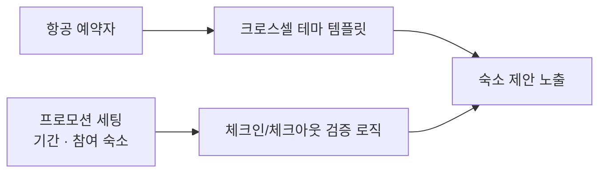

## 배경

- 숙박 세일 페스타(정부 연계 대규모 할인 행사, 연 3회)와 제휴 프로모션(제주 신화월드 등)은 트래픽과 매출이 집중되는 이벤트지만, 매번 일회성 코드로 대응하고 있었음
- 반복 패턴(항공→숙소 크로스셀, 테마 전시)을 기능으로 내재화해 운영 비용을 줄이는 방향으로 진행

## 주요 작업

- **숙박 세일 페스타 운영** (2025년 3·6·9월): 기간/참여 숙소 세팅, 체크인·체크아웃 기간 검증 로직, 발급 기간 연장·조기 종료 대응, 특별재난지역 쿠폰 대응
- **제주 신화월드 프로모션**: 항공 구매자 대상 조건, 쿠폰 보유자별 분기, 지역·투숙 기간 필터, 앱 버전 조건 등 노출 로직 구현과 딥링크 개인화 대응
- **크로스셀 테마 내재화**: 항공 예약자에게 숙소를 제안하는 크로스셀 뷰타입을 일회성 하드코딩에서 **테마 템플릿 기반 시스템 기능**으로 전환 — 운영자가 쿠폰·대상 숙소·지역·노출/투숙 기간을 직접 관리하는 어드민 구조로 내재화, 국내선 등 노선 확장
- 세일 페스타 런칭 프로세스를 매뉴얼·체크리스트로 문서화, 프로모션 배너 등록 고도화 등 운영 도구 개선

## 성과

- **제주 신화월드 딜: GMV 목표 대비 133.5% 초과 달성, 확정 Room Night 142.1%** — 항공→숙소 크로스셀 전환 비율이 **4% → 15%(3.8배)** 로 개선되어 앵콜 딜 성사로 연결
- 연 3회 대규모 행사를 **장애 없이 반복 운영**할 수 있는 세팅·검증·체크리스트 체계 확립 — 회차가 누적돼도 오류 없이 반복 가능한 운영 구조
- 크로스셀이 기능화되어 신규 프로모션마다 들어가던 개발 공수 제거 — 이후 프로모션은 세팅만으로 진행
