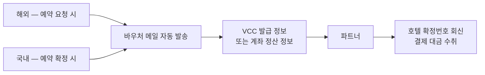

## 배경

- 해외 직계약 숙소는 계좌 정산이 어려운 경우가 많아, 예약별로 발급되는 **가상카드(VCC)** 로 파트너가 직접 결제 대금을 수취하는 방식이 필요했음
- 객실 수배 요청서를 메일로 보내는 호텔이 **57곳·월 2,400여 건** 규모였는데, VCC 발급부터 메일 작성까지 운영팀이 **예약 1건당 약 30분씩 수기로 처리**하고 있어 프로모션 확대 시 운영 병목이 예상되는 상황이었음

## 주요 작업

- **VCC 예약/환불 연동** — 예약 생성 시 카드 발급 정보 연계, 결제 가능 기간 관리, 환불 시 처리 흐름 구현
- **바우처 메일 자동 발송** — 숙소·투숙 정보와 일자별 요금·추가 요금 내역, 결제 정보를 채워 자동 발송. **해외는 예약 요청 시점에 호텔로 확인 요청을, 국내는 예약 확정 시점에 안내를** 보내는 구조라 발송 트리거가 갈림

- **대금 지급 방식에 따라 템플릿을 분기** — VCC·오픈카드·계좌지급 3종으로 나누고, 국내/해외를 각각 한글·영문으로 분리. 숙소별 영문 메일 발송 여부를 매니저가 설정하도록 어드민 기능 추가

- **취소 시 위약 유형별 분기** — 전액 위약이면 기존 카드를 그대로, 일부 위약이면 한도를 위약금만큼 낮춰서, 무료 취소면 카드 정보 없이 발송. 확정 시 받아둔 호텔 확정번호를 취소 요청서에 자동 반영
- 예약 시 추가 인원 정보 저장, 외화 스냅샷 기준 금액 표기 등 정확성 개선
- 이후 IDR 등 **신규 통화 추가**와 VCC 정산 연동 확장 대응

## 성과

- **예약 1건당 약 30분 걸리던 수기 메일링 리소스를 제거**해 프로모션 확대에 대비한 운영 병목 해소
- 예약 취소 시에도 위약 유형에 맞는 카드 정보와 확정번호가 자동 포함되어, 파트너 커뮤니케이션의 정확도와 속도 개선
- 국내 숙소까지 발송 체계를 확장해 파트너 채널 전반의 표준 프로세스로 정착
