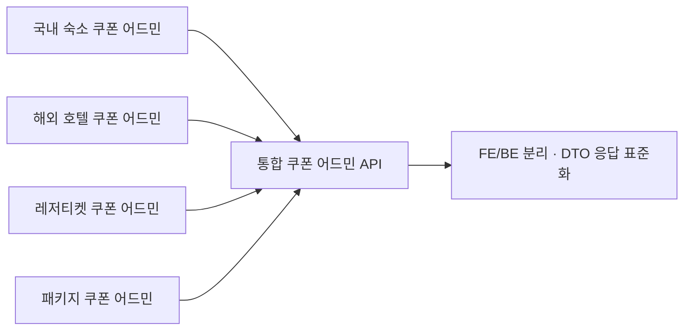

## 배경

- 국내 숙소, 해외 호텔, 레저티켓, 패키지 등 상품 카테고리마다 쿠폰 어드민 로직이 흩어져 있어, 같은 기능을 여러 곳에서 고쳐야 하는 관리 비용이 컸음
- 쿠폰 관련 어드민 API의 관리 포인트를 하나로 통합하고 구조를 개선하는 작업을 담당

## 주요 작업

- 카테고리별로 흩어져 있던 쿠폰 어드민 API **관리 포인트 통합**
- 중복 코드 제거, 메서드·레이어 역할 분리로 가독성과 유지보수성 개선
- JSP에 뒤섞여 있던 로직을 **프론트/백엔드 분리 + API 방식**으로 전환
- Map 형태로 내려가던 응답을 **DTO 기반**으로 전환해 데이터 처리 일관성 확보
- 운영·기획 팀과 소통하며 쿠폰 기능 개선과 추가 요구사항을 지속 반영

## 성과

- 쿠폰 기능 수정이 **한 곳에서 이뤄지는 구조**로 바뀌어 카테고리별 중복 수정 제거
- 레거시(JSP·Map 응답) 정리로 이후 기능 추가·요구사항 반영 속도 개선
