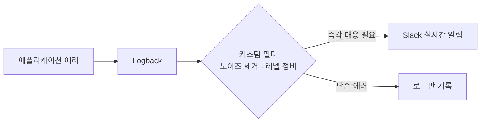

## 배경

- 에러 발생 시 담당자가 수동으로 메시지를 작성해 전송하고 있었고, 알림 전송 코드가 비즈니스 로직 곳곳에 섞여 있어 대응 지연과 코드 오염이 함께 발생했음

## 주요 작업

- 수동 메시지 작성·전송을 **Logback 기반 자동 알림**(Slack Webhook)으로 전환
- 비즈니스 로직에 흩어져 있던 수동 전송 코드를 제거해 관심사 분리
- 단순 로그인 실패처럼 즉각 대응이 불필요한 에러를 걸러내는 **Logback 커스텀 필터** 구현
- 로그 레벨 정비로 비즈니스적으로 유의미한 에러만 노출되도록 조정

## 성과

- 에러 인지가 수동 보고에서 **실시간 자동 알림**으로 전환되어 대응 속도 향상
- 노이즈 알림이 걸러져 중요한 에러에 집중할 수 있는 환경 확보, 비즈니스 코드 가독성도 개선
