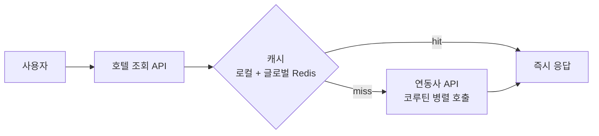

## 배경

- 투어 서비스에 해외 호텔 상품 카테고리를 신설하면서, 외부 연동사의 호텔 데이터를 받아 전시·판매하는 시스템을 처음부터 구축해야 했음
- 연동사 실시간 API에 의존하는 구조 특성상 조회 성능과 장애 대응이 핵심 과제였음

## 주요 작업

- 호텔 전시, 호텔 목록/상세 조회 API와 관련 쿠폰·어드민·파트너 API 개발 담당
- **캐시 전략 설계**: 글로벌 캐시(Redis)와 로컬 캐시를 구분해 데이터 성격별로 효율적으로 관리
- **코루틴 비동기 호출** 도입으로 연동사 실시간 API 다건 호출을 병렬화
- 신규 연동사 추가에 대비한 **연동 레이어 추상화** — 확장성을 고려한 설계
- 에러를 중요도별로 분류하고, 즉각 대응이 필요한 에러에 대한 알림 시스템 구축
- 로그 분산 추적 라이브러리 적용으로 MSA 구조에서의 요청 추적 용이성 확보

## 성과

- 호텔 목록 조회 latency **약 4s → 25ms** (캐시 적용)
- 연동사 실시간 API 호출 latency **약 6s → 3s** (코루틴 병렬 호출)
- 연동 추상화 덕분에 신규 연동사를 기존 구조 변경 없이 추가할 수 있는 기반 확보
