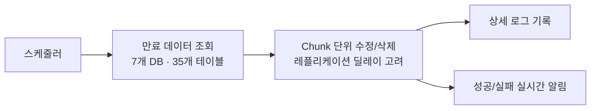

## 배경

- 개인정보 보호 정책상 보유기간이 지난 개인정보·로그 데이터는 파기해야 하지만, 투어 서비스에 수년치 미처리 데이터가 누적되어 있었음
- 서비스가 사용하는 운영 DB를 그대로 다루는 작업이라, **대량 처리와 무중단**을 동시에 만족해야 했음

## 주요 작업

- 보유기간이 지난 개인정보·로그 데이터를 수정/삭제하는 배치 프로세스 개발 — **7개 데이터베이스, 35개 테이블** 대상
- 과거 누적분 **7,400만 건**을 시스템 성능에 영향 없이 처리하는 대량 배치 설계
- 이후 신규 만료분은 **일 약 10만 건** 규모로 자동 처리되도록 상시 배치 활성화·최적화
- **레플리케이션 딜레이를 고려한 처리 로직** 설계로 원본-복제 DB 간 데이터 일관성 유지
- 작업 상세 로그 기록과 성공/실패 실시간 알림으로 관리자가 즉시 대응 가능한 운영 체계 구성

## 성과

- 누적 7,400만 건 파기를 **서비스 이상 없이 완료**, 개인정보 보유기간 정책 준수 상태로 정상화
- 이후에는 사람 개입 없이 일 단위로 자동 파기되는 체계 정착
